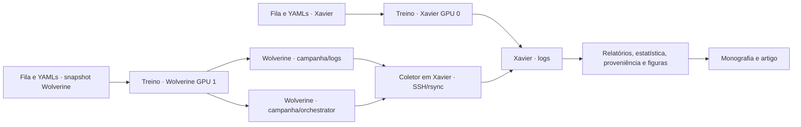

# Dependências operacionais e restrições à reorganização

> O levantamento abaixo descreve os checkouts operacionais antes da refatoração.
> O arranjo do snapshot privado é descrito na [etapa 2](RESTRUCTURING_STAGE2.md);
> seus caminhos novos não foram implantados nos hosts.

Levantamento em 11 de setembro de 2026, aproximadamente 11:02–11:04
(America/Campo_Grande). É uma fotografia operacional, não um monitoramento
contínuo nem uma comprovação de conclusão científica dos experimentos.

Foram consultados processos, serviços, diretórios de trabalho e descritores
de arquivos de Xavier e Wolverine, além de processos/serviços da Quati.
As consultas remotas foram somente de leitura. Nenhuma fila, configuração,
serviço, log, snapshot remoto ou ambiente foi alterado.

O arquivo [DEPENDENCY_SNAPSHOT_20260911.json](DEPENDENCY_SNAPSHOT_20260911.json)
registra 21 filas, 309 entradas e 94 YAMLs distintos referenciados no checkout
local, incluindo dependências reversas, hashes e ordem dos overlays. As
configurações são mescladas superficialmente, como em `utils/configuration.py`.
Esse inventário não resolve symlinks de datasets nem substitui o manifesto
efetivo de um treinamento. Não inclui como filas os runners que enumeram
experimentos diretamente em shell, como o estudo do mecanismo ANT.

## Estado observado por host

| Host | Estado observado | Código utilizado | Produtores e consumidores |
|---|---|---|---|
| Xavier | Treinamento e coleta ativos | `/home/tiago/TagFex_CVPR2025` | Treino escreve em `logs/`; coletor também escreve nesse diretório; análises e monografia o consomem |
| Wolverine | Treinamento ANT ativo na GPU 1 | `/var/tmp/tiago/ANT_central_extra_seeds_20260906/repo` | Escreve em `../logs/` e `../orchestrator/`; Xavier coleta resultados |
| Quati (`quaTII`) | Inativa por confirmação do responsável; nenhum processo/serviço TagFex correspondente aos padrões consultados | Checkout legado e diretórios RAID descritos nos guias | Há referências históricas de armazenamento e sincronização; não há prova de ausência de qualquer trabalho fora desses padrões/usuário |
| Fera | Inativa por confirmação do responsável; sem inspeção direta | Localização operacional não confirmada nesta auditoria | A análise do mecanismo ANT atribui execuções a esse host; término descrito no documento não demonstra ausência de outras campanhas |

A listagem inicial dentro do isolamento não enxergava os processos do host e
não acessava o bus do usuário. A classificação de Xavier acima usa a consulta
posterior fora desse isolamento. Ausência na listagem isolada não é evidência
de inatividade.

## Caminho de execução em Xavier

- Unidade: `ant-central-extra-seeds-xavier-gpu0-recovery1-20260911.service`.
- WorkingDirectory: `/home/tiago/TagFex_CVPR2025`.
- ExecStart: `/usr/bin/bash ./run_ant_central_extra_seeds_local.sh`.
- Cadeia: wrapper → `run_sbs_queue.sh` (PID 990700) →
  `auto_run_on_free_gpu.py` → `main.py train` (PID 990911).
- Fila aberta: `configs/queue_ant_central_extra_seeds_local.txt`.
- O log da retomada estava em `[17/17]`, após skips das entradas precedentes.
  Isso é posição na fila, não validação independente de todos os resultados.
- Treino atual: Tiny ImageNet 20-20, ANT-FS-AR com detach, seed 1997, GPU 0.
- YAMLs, nesta ordem:
  1. `configs/all_in_one/tiny_imagenet_20-20_antB0.5_nceA1_antM0.5_antSymmetricFullGlobal_resnet18.yaml`;
  2. `configs/ant_central_extra_seeds/common.yaml`;
  3. `configs/ant_central_extra_seeds/fs_ar.yaml`;
  4. `configs/ant_central_extra_seeds/storage_local.yaml`.
- Diretório com gist/std/debug abertos:
  `logs/exp_tiny_imagenet_20-20_antB0.5_nceA1_antM0.5_antSymmetricFull_nceGlobal_refDetached_s1997/`.
- Console: `logs/auto_experiments/ant_central_extra_seeds_local_console/`.
- Orquestrador: `logs/auto_experiments/ant_central_extra_seeds_local_orchestrator.log`.
- Lock: `/tmp/tagfex_ant_central_extra_seeds_local.lock`.
- Ambiente observado: `.venv`, `CUDA_VISIBLE_DEVICES=0`, `UPDATE_REPORT=0`,
  `TAGFEX_DATASET_HASH_MODE=structure`.

O YAML base tem `SymmetricFullGlobal` no nome, mas o overlay `fs_ar.yaml`
define a condição efetiva. Classificar o experimento somente pelo nome do
primeiro YAML daria uma classificação incorreta.

## Caminho de execução em Wolverine

- Acesso identificado: `tiago@10.87.10.46:2222`; chave dedicada configurada
  pelo coletor. Nenhum conteúdo de chave foi lido ou registrado.
- Unidade: `ant-central-extra-seeds-wolverine-gpu1-recovery2-20260911.service`.
- WorkingDirectory: `/var/tmp/tiago/ANT_central_extra_seeds_20260906/repo`.
- ExecStart: `/usr/bin/bash ./run_ant_central_extra_seeds_wolverine_gpu1_recovery.sh`.
- Cadeia: wrapper → `run_sbs_queue.sh` (PID 147302) → launcher →
  `main.py train` (PID 147476).
- Fila: `configs/queue_ant_central_extra_seeds_wolverine_gpu1_recovery.txt`.
- Estado no log: `[1/18]`; a recuperação serializa trabalho restante das
  duas filas originais na GPU 1. Não inferir dois treinos ANT atuais a partir
  da presença dos wrappers `gpu0` e `gpu1` no repositório.
- Treino atual: Tiny ImageNet 20-20, ANT-IV-AR com detach, seed 1996.
- Composição: mesmo YAML base Tiny ImageNet 20-20 usado em Xavier, seguido
  de `common.yaml`, `iv_ar.yaml` e `storage_wolverine.yaml` da campanha.
- Logs abertos:
  `/var/tmp/tiago/ANT_central_extra_seeds_20260906/logs/exp_tiny_imagenet_20-20_antB0.5_nceA1_antM0.5_antLocal_nceGlobal_refDetached_s1996/`.
- Orquestrador: `../orchestrator/ant_central_extra_seeds_wolverine_gpu1_recovery.log`.
- Consoles: `../orchestrator/gpu1_recovery_console/`, conforme o wrapper.
- Lock configurado: `/tmp/tagfex_ant_central_extra_seeds_wolverine_gpu1.lock`.
- A `.venv` do snapshot é um symlink para
  `/home/tiago/TagFex_CVPR2025/.venv` **na Wolverine**. O snapshot não é
  independente desse ambiente no checkout antigo.
- Entradas CUB futuras dependem de
  `/var/tmp/tiago/ANT_detach_cub20_20260904/datasets/CUB_200_2011`, conforme
  `dataset_cub_wolverine.yaml`. A campanha anterior não pode ser considerada
  removível apenas porque seus treinamentos terminaram.

Foram comparados SHA-256 de `main.py`, `methods/tagfex/tagfex.py`,
`run_sbs_queue.sh` e da fila de recuperação: os quatro arquivos coincidem
entre Xavier e o snapshot Wolverine. Isso não atesta igualdade dos checkouts
inteiros, ambientes, datasets ou de todos os overlays. As linhas do inventário
JSON representam os YAMLs locais; a fila remota foi conferida por conteúdo/hash.

## Sincronização ativa e dependências de leitura

- Unidade local: `sync-wolverine-central-extra-seeds-recovery2-20260911.service`.
- Wrapper: `sync_wolverine_central_extra_seeds.sh`.
- Implementação executada: `sync_wolverine_refdetach_results.sh`, PID 992558.
  O nome legado `refdetach` não identifica sozinho a campanha efetiva.
- `REMOTE_ROOT=/var/tmp/tiago/ANT_central_extra_seeds_20260906`.
- `REMOTE_ORCHESTRATOR=/var/tmp/tiago/ANT_central_extra_seeds_20260906/orchestrator`.
- `LOCAL_RESULTS=/home/tiago/TagFex_CVPR2025/logs`.
- `LOCAL_ORCHESTRATOR=.../logs/auto_experiments/wolverine_central_extra_seeds_20260906`.
- `RUN_MODE=watch`, `COMPLETED_ONLY=1`.
- `REMOTE_UNITS=ant-central-extra-seeds-wolverine-gpu1-recovery2-20260911.service`:
  valor confirmado no ambiente do processo, que sobrepõe os nomes antigos
  presentes como defaults no wrapper. O coletor acompanha a unidade correta.
- Lock: `/tmp/tagfex_wolverine_central_extra_seeds_sync.lock`.
- Houve rsync ativo e registro `SYNC OK`. Os runs parciais eram excluídos da
  cópia pelo critério atual de contagem no gist. Esse critério operacional
  não substitui validação de tarefas, identidade, hashes e seleção científica.

`logs/` em Xavier tem produtores locais e remotos. Um arquivo recém-modificado
ali pode ter sido transferido, sem representar treino local. Relatórios,
estatísticas, inventários e scripts R consomem esse acervo; os consumidores
não devem confundir origem com localização atual. A atualização automática do
relatório está desativada na fila local observada (`UPDATE_REPORT=0`).

## Matriz de impacto para manutenção

| Dependência | Quando é usada | Consequência da movimentação/edição |
|---|---|---|
| Fila `.txt` | Shell mantém o arquivo aberto e lê progressivamente | Alterar, truncar ou substituir o arquivo cria ambiguidade entre conteúdo aberto e caminho; novas entradas podem mudar |
| YAMLs e ordem dos overlays | Reabertos na checagem e no lançamento de cada run | Editar um overlay pode mudar os próximos experimentos sem mudar a fila |
| Python do treinamento e módulos | Processo atual tem imports carregados; próximos runs carregam o checkout novamente | Uma fila pode passar a misturar revisões; arquivos importados tardiamente e fontes de proveniência continuam relevantes |
| Wrapper, executor e launcher | ExecStart, exec/subprocessos e retomadas | Mover quebra lançamentos futuros, serviços e comandos de recuperação |
| `.venv` e bibliotecas | Executáveis, imports e subprocessos | O snapshot remoto depende de um ambiente externo a ele |
| Dataset e symlinks | DataLoader abre amostras ao longo do treinamento | Mover ou remover origem pode interromper workers e etapas seguintes |
| Logs do treino | Descritores abertos e novas aberturas por caminho | Processo pode continuar escrevendo em inode movido enquanto consumidores usam outro caminho |
| Logs remotos e destino de coleta | rsync recorrente | Mover destino pode fazer a próxima coleta recriar o caminho antigo e dividir o acervo |
| Locks | flock durante a vida do processo | Apagar/recriar um lock pode permitir dois processos com locks em inodes diferentes |
| Unidade systemd e ambiente | ExecStart, WorkingDirectory e monitoramento remoto | Copiar apenas scripts não reproduz GPU, fila ou unidade monitorada efetivas |
| Manifestos científicos | Verificação e rastreio histórico | Não reescrever caminhos/hashes originais para acomodar uma migração; registrar relocação separadamente |
| Figuras e tabelas dos submódulos | Geradores R/Python, LaTeX e importação de resultados | Paths relativos, arquivos ignorados e dados transcritos precisam de consumidores identificados |

## Referências históricas e pendências

- Quati: SSH `tiago@10.87.10.217:2222`. Os guias indicam checkout legado em
  `/home/tiago/TagFex_CVPR2025`, campanhas futuras no RAID e resultados
  históricos em `/mnt/raid/home/tiago/logs`. O runner histórico
  `configs/ant_investigation/run_wolverine_parallel.sh` envia resultados de
  Wolverine para Quati: existe também essa direção de coleta no código.
- Controles antigos na Wolverine usam
  `/home/tiago/ANT_validation_20260812/repo` e o ambiente
  `/home/tiago/TagFex_updated/.venv`; são dependências estáticas dos runners,
  não execuções ativas confirmadas neste levantamento.
- Fera: falta confirmar acesso, checkout, unidades, dados, saídas e política
  de coleta. O diretório `study_outputs/` local não prova onde todos os
  artefatos originais estão nem se existe produtor remoto atual.
- Não foi realizado censo de processos de todos os usuários, cron, containers
  ou hosts desconhecidos. Nomes de processos diferentes podem escapar dos
  padrões consultados. O responsável confirmou posteriormente o conjunto de quatro hosts e a
  inatividade de Fera/Quati; veja a atualização ao final.

## Condições para uma migração posterior

1. Tratar checkout, fila, overlays, ambiente, datasets, logs e locks das
   execuções observadas como dependências que devem permanecer estáveis.
2. Preparar a refatoração em checkout separado e destinos de saída separados,
   sem aplicar sincronização de código por cima dos snapshots ativos.
3. Registrar por campanha host, raiz real, unidade, PID, GPU, ambiente,
   composição de configuração, origem/destino da coleta e hashes. Separar
   valores desejados do launcher dos valores observados no serviço.
4. Revalidar o estado antes de qualquer migração: esta fotografia envelhece.
   Encerramento de uma fila não basta se ainda há coleta ou consumidores.
5. Conferir todas as condições esperadas e a coleta final antes de mudar os
   caminhos. Preservar tentativas, manifestos e a relação origem/destino.
6. Atualizar produtores, consumidores, serviços e documentação como uma
   mudança coordenada. Não usar symlinks como substituto de auditar as
   dependências; alguns consumidores resolvem caminhos reais.

Para manutenção contínua, este mapa deve evoluir para um catálogo declarativo
de campanhas e um coletor somente de leitura de estado operacional. O JSON
anexo é um inventário pontual, não uma implementação desse monitoramento.

## Confirmação posterior do responsável

Em 11/09/2026, o responsável confirmou que não há outros hosts e que Fera e
Quati não estão sendo utilizadas. A relação operacional atual fica restrita
a Xavier e Wolverine. A falta de inspeção direta da Fera descrita acima é
limite da observação técnica, não uma pendência de confirmar se há campanha
ativa nesse host. Preservam-se referências da Fera/Quati como origem histórica
de dados e configurações; inatividade não equivale a autorização de apagar.
